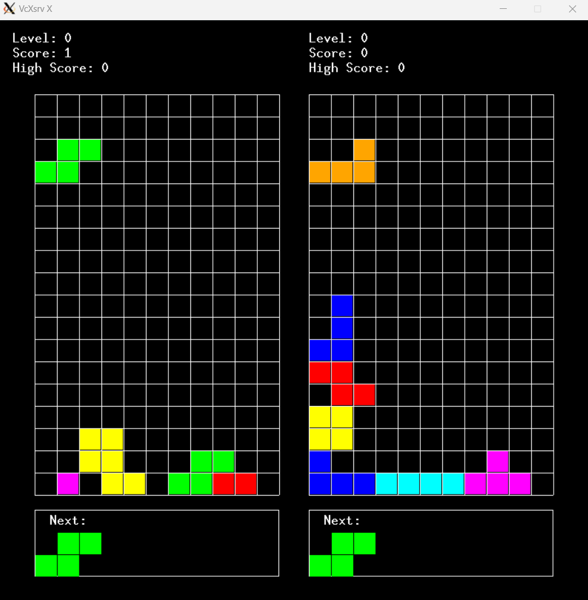
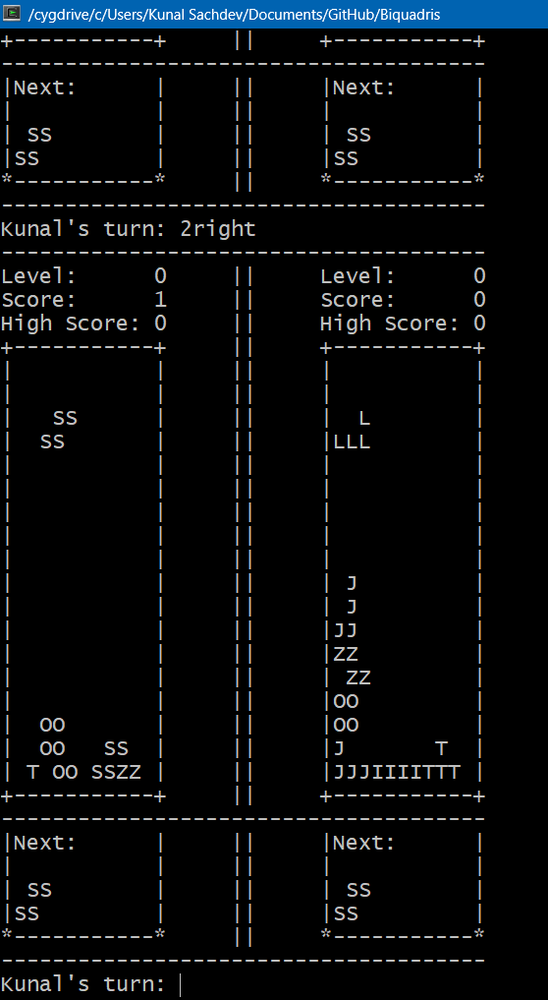

# Biquadris: Object-Oriented Multi-Player Tetris

### **Table of Contents**

1. [Introduction](#introduction)
2. [Features](#features)
3. [System Architecture](#system-architecture)
4. [Design Principles](#design-principles)
5. [Installation and Setup](#installation-and-setup)
6. [Usage](#usage)
7. [Technologies Used](#technologies-used)
8. [Acknowledgments](#acknowledgments)
9. [UML Class Diagram and Design Document](#links)
10. [Game Demo](#game-demo)

---

## **Introduction**

Biquadris is a two-player Tetris-inspired game developed in C++ with modular object-oriented architecture. This project was designed as part of the CS246 Object-Oriented Software Development course, emphasizing design patterns, extensibility, and team collaboration.

Unlike traditional Tetris, Biquadris incorporates turn-based mechanics, special actions, and level-specific challenges, creating a unique strategy-focused gameplay experience.

---

## **Features**

- **Turn-Based Gameplay**: Players alternate turns, strategizing to outscore their opponent.
- **Level System**: Dynamic difficulty levels influencing block generation and behavior.
- **Special Actions**: Triggered by clearing multiple rows, including:
  - Blind: Hides portions of the opponent's board.
  - Heavy: Adds gravity to the opponent's block.
  - Force: Replaces the opponent's block.
- **Multi-Mode Display**:
  - Textual interface for debugging and minimal setups.
  - Graphical interface using XWindows for a visually engaging experience.
- **Command-Based Interaction**: Intuitive commands for block manipulation, game control, and testing.

---

## **System Architecture**

### Core Components:

1. **Game Core**:

   - Manages the game flow, player turns, and command processing.
   - Key methods: `initialize()`, `start()`, `switchTurns()`.

2. **Board**:

   - Represents the 11x15 grid for block placement.
   - Handles block movements, rotations, and row clearing.
   - Key methods: `dropBlock()`, `clearRow()`.

3. **Blocks**:

   - Encapsulates different tetromino types (I, J, L, S, Z, O, T) and their behaviors.
   - Polymorphic design supports extensibility.

4. **Player**:

   - Tracks player-specific data (score, level, game state).

5. **Level System**:

   - Implements block generation policies using the Factory Method pattern.
   - Supports multiple levels with unique gameplay mechanics.

6. **Special Actions**:

   - Game effects - blind, force and heavy - designed using polymorphism for scalability.

7. **Display System**:

   - TextDisplay and GraphicDisplay modules for rendering the game state.
   - Uses Observer pattern for real-time updates.

8. **Command Interpreter**:

   - Parses and processes player commands dynamically.
   - Flexible design for easy extension.

---

## **Design Principles**

- **Encapsulation**: Each class encapsulates its state and behavior, ensuring minimal external dependencies.

- **Inheritance and Polymorphism**:

  - **Block Types**: The `Block` class serves as a base class and specialized blocks inherit from it to define block-specific shapes and rotations. Polymorphic behavior is seen when calling `rotate()` on different types of `Block` objects, enabling unique transformations for each block type.
  - **Levels**: The `Level` class provides a base for level-specific behavior, and child classes override the `generateBlock()` method to customize block generation logic. The method is invoked on a `Level` object without needing to know the specific subclass, allowing seamless integration of future level types.
  - **Special Actions**: The `SpecialAction` class is a parent for all special actions, offering a polymorphic interface for applying player effects. The `execute()` method can be invoked regardless of the specific type of special action, ensuring flexibility for future extensions.

- **Design Patterns**:

  - Factory Method for block generation.
  - Observer Pattern for display updates.

- **Resilience to Change**:
  The design exhibits high resilience to change, adhering to OOP principles and using design patterns to minimize coupling between components. Examples include:

  - Adding new block types or changing block shapes by simply creating a new subclass of `Block` or redefining existing shapes.
  - Introducing new levels by deriving from the `Level` base class and overriding block generation logic.
  - Adding special actions by extending the `SpecialAction` class and defining the `execute()` method.
  - Enhancing UI by modifying the display classes without affecting game logic.
  - Supporting new commands or renaming existing ones by updating the `CommandInterpreter` class.

---

## **Installation and Setup**

### Prerequisites:

1. **Operating System**: Windows with Cygwin.
2. **Development Tools**:
   - GCC compiler supporting C++11 or higher.
   - XWindows libraries for graphical display.
3. **Optional**:
   - XMing for Windows users.
   - Git for version control.

### Build Instructions:

1. Clone the repository:

   ```bash
   git clone https://github.com/<your-repo-name>/Biquadris.git
   cd Biquadris
   ```

2. Build the project using the provided Makefile:

   ```bash
   make
   ```

3. Run the game (text display only):

   ```bash
   ./biquadris -text
   ```

   For text and graphical display:

   ```bash
   ./biquadris
   ```

---

## **Usage**

### Command-Line Options:

- `-text`: Runs the game in text-only mode.
- `-startlevel <n>`: Starts the game at level `<n>`.
- `-seed <value>`: Sets the random number generator seed.

### In-Game Commands:

- Movement: `left`, `right`, `down`.
- Rotation: `clockwise`, `counterclockwise`.
- Special: `levelup`, `leveldown`, `norandom file`, `random`.
- Control: `restart`, `drop`.

---

## **Technologies Used**

- **Programming Language**: C++ (C++11 standard)
- **Libraries**: XWindows for graphical display
- **Tools**: Git for version control, Make for build automation
- **Environment**: Windows with Cygwin

---

## **Acknowledgments**

This project was collaboratively developed by Kunal Sachdev and Aarav Surana as part of the CS246 Object-Oriented Software Development course at the University of Waterloo.

---

### Links:

- **GitHub Repository**: [GitHub](https://github.com/KunalSachdev2005/Biquadris)
- **UML Class Diagram**: [uml-final.pdf](./uml-final.pdf)
- **Design Document**: [design.pdf](./design.pdf)
  
---

## **Game Demo**





